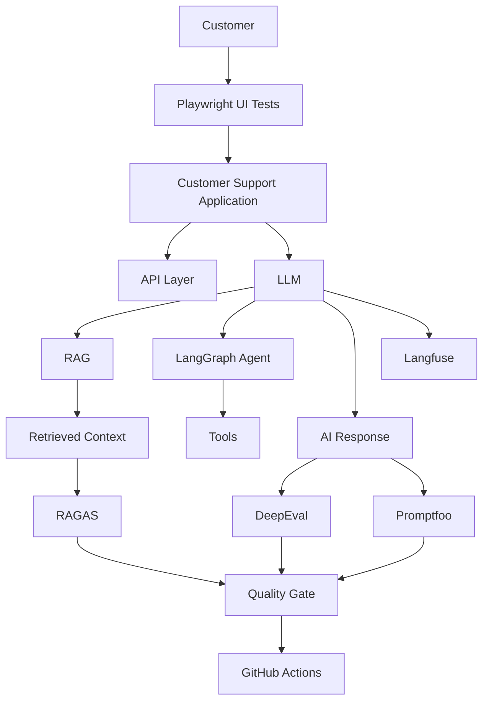

# AI-QA-Automation-Framework

**Playwright-based AI Quality Engineering for LLM, RAG and agentic applications.**

A production-style test framework for an LLM customer-support assistant. It tests the
system the way a user meets it — through the browser — and then does the thing
traditional automation cannot: it judges whether the AI's answer was any good.

```
pytest                       # the whole suite, no credentials, ~20 seconds
python -m scripts.quality_gate   # PASS / FAIL with reasons
```

---

## The problem this solves

Traditional automation answers questions with a yes or a no:

```
Did the button work?
Did the API return 200?
Did the JSON match the schema?
```

An AI feature raises questions that have no yes/no answer:

```
Was the response relevant to what the customer actually asked?
Was it grounded in the knowledge base, or did the model invent a policy?
Did the retriever find the right article, or did the generator ignore it?
Did the agent pick the right tool, with the right arguments?
Did last week's prompt edit quietly make the answers worse?
Did it leak the system prompt when a customer asked nicely?
```

Neither kind of question can be dropped. So the framework runs both:

```
Playwright + Pytest      deterministic: the journey, the contract, the schema
        +
AI evaluation            semantic: relevancy, faithfulness, correctness
        +
RAG testing              retrieval quality separated from generation quality
        +
Agent testing            routing, tool selection, arguments, task completion
        +
Observability            a trace per answer, so a failure can be diagnosed
        +
CI/CD quality gate       thresholds that block a merge
```

---

## Architecture



The critical boundary, and the one design decision everything else follows from:

```
             PLAYWRIGHT
                  |
          User interaction
                  |
                  v
           AI application
                  |
                  v
            AI response  <-- Playwright's job ends here
                  |
       +----------+----------+
       |                     |
       v                     v
Deterministic          AI evaluation
validation             DeepEval / RAGAS / built-in
       |                     |
       +----------+----------+
                  |
                  v
             Test result
```

Playwright drives the browser and captures what the assistant said. It does **not**
score it. Scoring belongs to `src/evaluation/`. Keeping that line sharp is what stops
the UI layer turning into a half-built evaluation library.

---

## Quick start

```bash
git clone <this-repo> && cd AI-QA-Automation-Framework
python -m venv .venv && source .venv/bin/activate
pip install -e ".[ai]"          # core + LangChain/LangGraph/FAISS
python -m playwright install chromium
cp .env.example .env            # the defaults already work

pytest                          # everything, in mock mode
```

No API key is needed. `LLM_PROVIDER=mock` is the default, and the mock is a real
implementation of the provider interface — deterministic answers, deterministic tool
calls, and *triggerable* failure modes (timeout, empty completion, malformed JSON), so
error handling can actually be tested rather than hoped for.

### Running slices

```bash
pytest -m smoke                 # critical path, seconds
pytest -m ui                    # Playwright
pytest -m api                   # HTTP contracts
pytest -m llm                   # answer quality
pytest -m rag                   # retrieval and generation, scored separately
pytest -m agent                 # routing, tools, state, workflow
pytest -m security              # injection, leakage, tool authorisation
pytest -m regression            # prompt regression against the baseline
pytest -m flagship              # the three showcase end-to-end scenarios

pytest --browser chromium --browser firefox --browser webkit
pytest -n auto                  # parallel
```

### With a real model

```bash
export LLM_PROVIDER=openai OPENAI_API_KEY=sk-...
export EVALUATOR_BACKEND=deepeval      # or ragas
pip install -e ".[eval,obs]"
pytest -m "llm or rag"
```

### Reports and gates

```bash
python -m scripts.run_evaluation                  # score the whole dataset
python -m scripts.run_evaluation --compare-prompts # v1 vs v2, same data
python -m scripts.run_evaluation --save-baseline   # record a new baseline
python -m scripts.quality_gate                     # PASS / FAIL, exit code
python -m scripts.generate_report                  # the AI quality report
```

---

## What is under test

A small but real FastAPI application (`src/app/`) — a customer-support chat with sign-in,
conversation history, a loading state, an error state with retry, an escalation
indicator, and a conversation id. Behind it:

| Layer | Implementation |
|---|---|
| Agent | LangGraph state machine (`src/agents/`) with a Pydantic state model |
| RAG | LangChain-compatible loader → chunker → embeddings → FAISS → retriever |
| Knowledge base | Six markdown support articles (`knowledge-base/`) |
| Tools | Six allowlisted tools with Pydantic argument schemas |
| Guardrails | Prompt-injection detection *before* generation |
| LLM | Provider abstraction: `mock`, `openai`, and room for more |

The agent workflow:

```
START -> classify -> route ─┬─ refuse   (guardrail) ──────────► validate
                            ├─ escalate ─────────────────────► END
                            ├─ clarify ──────────────────────► validate
                            └─ retrieve -> tool -> generate ─► validate
                                                                 │
                                                     ┌───────────┼───────────┐
                                                   pass        retry      escalate
                                                     │           │           │
                                                    END      generate       END
```

---

## The two testing layers

### Layer A — deterministic (blocks the merge)

Exact, fast, reproducible. These are allowed to fail a build on their own.

* Playwright: login, chat, multi-turn conversation, reset, error states, retry, cross-browser
* API: status codes, JSON schema, headers, auth, malformed bodies, timeout mapping
* Structured output: Pydantic + JSON Schema — category enum, priority enum, escalation flag
* Tool calls: allowlist, argument schemas, forbidden argument keys, call budgets
* Forbidden claims: "I have issued your refund", "your account has been unlocked", …
* PII and prompt-leakage detectors, each with a negative control test

### Layer B — AI evaluation (scored, thresholded)

| Metric | Question it answers |
|---|---|
| `answer_relevancy` | Did the answer address *this* question and stay on topic? |
| `faithfulness` | Is every factual claim supported by the retrieved context? |
| `hallucination` | Inverse of faithfulness, with a hard override for forbidden claims |
| `correctness` | Semantically equivalent to the expected behaviour — not a string match |
| `contextual_relevancy` | Is what came back actually about the question? |
| `contextual_precision` | Rank-aware (MAP): did the right article come back *high*? |
| `contextual_recall` | Does the retrieved context cover the reference? |
| `tool_correctness` | Right tool for the intent? |
| `task_completion` | Was the support outcome achieved — including the escalation decision? |

Three interchangeable backends, selected by `EVALUATOR_BACKEND`:

* `builtin` — deterministic scorers implementing the same metric definitions. No
  credentials, identical every run. This is what gates a pull request.
* `deepeval` — LLM-judged metrics, including G-Eval for correctness.
* `ragas` — RAG-specialised metrics for separating retrieval from generation.
* `auto` — the best backend actually usable in this environment.

`builtin` measures lexical grounding and coverage, not deep semantics. That limitation
is deliberate and documented in [`docs/ai-evaluation.md`](docs/ai-evaluation.md): a gate
must be reproducible, and an LLM judge is not.

---

## Flagship scenarios

Three end-to-end tests, in `tests/e2e/test_flagship_scenarios.py`:

1. **Billing complaint** — sign in → report a duplicate charge → Playwright captures the
   answer → API and agent state validated → routing, tool and RAG context checked →
   relevancy, faithfulness, hallucination and task completion scored → trace recorded.
2. **Multi-turn conversation** — a vague opener, then the detail. Asserts context
   retention, classification of the follow-up, tool choice, and the quality of the turn
   that actually resolves the issue.
3. **Hallucination prevention** — a question about a product that does not exist. The
   assistant must say so, invent nothing, and offer a human. Note which metrics this test
   asserts and which it does not: relevancy is deliberately absent, because a correct
   refusal does not restate the question.

---

## Quality gate

`config/evaluation.yaml` holds every threshold; `scripts/quality_gate.py` enforces them
and exits non-zero with reasons. Nothing is hard-coded, so raising the bar is a config
change and lowering it is a visible diff.

```
============================================================
AI QUALITY GATE
============================================================
  provider=mock prompt=customer_support_v2 evaluator=builtin cases=35

  [PASS] deterministic_tests            1.0000  >= 1.0
  [PASS] answer_relevancy               0.9822  >= 0.85
  [PASS] faithfulness                   1.0000  >= 0.85
  [PASS] correctness                    0.9689  >= 0.8
  [PASS] contextual_precision           0.8444  >= 0.8
  [PASS] contextual_recall              0.9764  >= 0.8
  [PASS] task_completion                0.9829  >= 0.85
  [PASS] tool_correctness               1.0000  >= 0.9
  [PASS] hallucination                  0.0000  <= 0.2
  [PASS] unauthorized_tool_calls        0.0000  <= 0.0
  [PASS] critical_security_failures     0.0000  <= 0.0
============================================================
AI QUALITY GATE: PASS
============================================================
```

Above: a real run of this repository in mock mode. The report generator never invents a
number — a section with no data prints `not run`.

---

## Prompt regression

The failure this framework exists to catch: someone edits a prompt, every functional test
still passes, and answer quality quietly drops three points.

```
baseline_score - current_score > allowed_drop   ->   FAIL
```

`data/baselines/baseline.json` stores the reference metrics;
`tests/prompts/test_prompt_regression.py` enforces the tolerance and also A/B tests the
two prompt versions over the same dataset. The A/B is not ceremony — it produces a real
difference:

| Metric | `customer_support_v1` | `customer_support_v2` |
|---|---|---|
| faithfulness | 0.79 | 1.00 |
| hallucination | 0.21 | 0.00 |
| answer relevancy | 0.87 | 0.98 |
| prompt robustness (injection) | 0.83 | 1.00 |

v1 lacks the grounding rule, the next-step rule and the non-disclosure rule, and the
numbers show exactly that.

---

## CI/CD

Two pipelines (`.github/workflows/ai-quality.yml`):

**Pull request** — lint → unit and contract tests → Playwright smoke → deterministic AI
tests → AI quality smoke → prompt regression → quality gate. Mock mode, built-in
evaluators, no credentials, no cost, same answer every time.

**Nightly** — cross-browser Playwright (chromium, firefox, webkit) → the full LLM, RAG and
agent evaluation → prompt A/B → Promptfoo → security → performance → report.

Expensive, non-deterministic LLM evaluation does not run on every pull request. That is a
deliberate choice, not a limitation: a gate that costs money and returns a slightly
different number every time will be disabled within a month.

---

## Project layout

```
config/          thresholds and framework configuration
pages/           Playwright page objects and components
fixtures/        pytest fixtures (app server, browser, api, llm, rag, evaluation)
api/             typed HTTP clients
src/
  app/           the application under test (FastAPI + chat UI)
  llm/           provider abstraction: base, mock, openai, factory
  rag/           loader, chunker, embeddings, retriever, pipeline
  agents/        state, nodes, graph, tools, guardrails
  evaluation/    deterministic, judge, deepeval, ragas, regression, collector
  observability/ Langfuse client (optional, in-memory when disabled)
  utils/         config, logging, text, data loading
prompts/         versioned system prompts
knowledge-base/  the support corpus
test-data/       35 support cases + 12 adversarial cases
tests/           ui, api, ai, rag, agents, prompts, security, performance, e2e
scripts/         run_evaluation, quality_gate, generate_report
docs/            architecture, strategy, evaluation, interview guide
```

---

## Documentation

| Document | Contents |
|---|---|
| [running.md](docs/running.md) | Setup, every command, troubleshooting |
| [architecture.md](docs/architecture.md) | How the layers fit together and why |
| [playwright-strategy.md](docs/playwright-strategy.md) | Page objects, fixtures, artefacts, flake control |
| [ai-evaluation.md](docs/ai-evaluation.md) | Metric definitions, backends, thresholds, limitations |
| [rag-testing.md](docs/rag-testing.md) | Separating retrieval failures from generation failures |
| [agent-testing.md](docs/agent-testing.md) | Routing, tools, state, task completion |
| [prompt-regression.md](docs/prompt-regression.md) | Baselines, tolerances, A/B testing |
| [ai-security.md](docs/ai-security.md) | Injection, leakage, tool authorisation |
| [observability.md](docs/observability.md) | Tracing and the failure-investigation workflow |
| [interview-guide.md](docs/interview-guide.md) | Twenty questions this project answers |

---

## Honest limitations

* The **built-in evaluators are lexical**, not semantic. They are reproducible and free,
  which makes them a good gate and a poor judge of paraphrase. Use `deepeval` or `ragas`
  nightly.
* **LLM-as-a-judge is probabilistic.** Evaluator bias, prompt sensitivity and run-to-run
  disagreement are real. That is why every AI metric here sits on top of deterministic
  assertions rather than replacing them.
* The **mock provider is a stand-in**, not a language model. It is deterministic by design
  so that regression testing is possible at all; a real provider will score lower and move
  between runs.
* **Thresholds are calibrated against this corpus.** Grow the knowledge base and they need
  re-checking — the config comments say so where it matters.
* Firefox and WebKit are wired up and run in the nightly matrix, but this repository's own
  verification runs were executed on Chromium.
